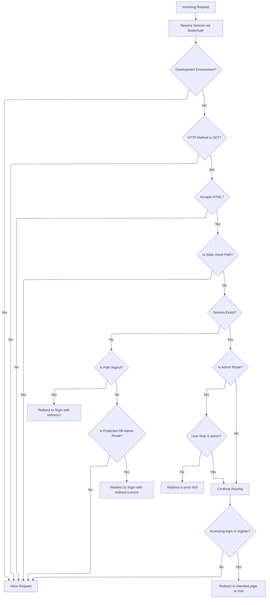

```mermaid
%%{init: { 'theme':'default', 'layout': 'elk' }}%%

flowchart TD
    A[Incoming Request] --> AA[Resolve Session via BetterAuth]

    AA --> B
    
    B{Development Environment?}

    B -- Yes --> Z[Allow Request]
    B -- No --> C{HTTP Method is GET?}

    C -- No --> Z
    C -- Yes --> D{Accepts HTML?}

    D -- No --> Z
    D -- Yes --> E{Is Static Asset Path?}

    E -- Yes --> Z
    E -- No --> G{Session Exists?}

    %% UNAUTHENTICATED ROUTING

    G -- No --> H{Is Path /logout?}
    H -- Yes --> I[Redirect to /login with redirect=/]
    H -- No --> J{Is Protected OR Admin Route?}
    J -- Yes --> K1[Redirect to /login with redirect=current]
    J -- No --> Z

    %% AUTHENTICATED ROUTING (ADMIN ROLE CHECK)

    G -- Yes --> K{Is Admin Route?}
    K -- Yes --> L{User Role is admin?}
    L -- No --> M[Redirect to error 403]
    L -- Yes --> N[Continue Routing]
    K -- No --> N

    %% AUTHED USERS SHOULD NOT HIT LOGIN/REGISTER

    N --> O{Accessing login or register?}
    O -- Yes --> P[Redirect to intended page or root]
    O -- No --> Z

    Z[Allow Request]
```
